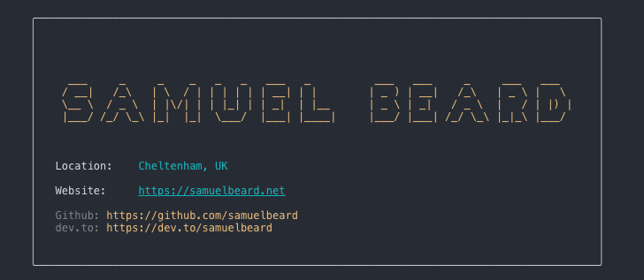

# I AM

Have you every seen those little cards people make with information about themselves on. You know. The ones that are node packages. The ones where you go `npx samuelbeard` and it displays it in the terminal.

I figured, instead of everyone making their own, lets make one BIG one that everyone can contribute to!

```
npx i-be samuelbeard
```


---

## How it works

Simply run the command below with your username to get back your personal card.

```sh
npx i-be {username}

# eg:
npx i-be samuelbeard
```

> For yours to work, you will need to create it. Have a read of the contributing section below.

---

## Contributing

Here is how to get your card working:

1. Fork this repo
2. Create a branch with this naming convention: `new-profile/{username}`
2. Create a new json file in the /profiles directory. (The name of the json file must be your username. E.g `samuelbeard.json`)
3. Use the template JSON file to add information to your JSON file.
4. Commit and push everything to your branch.
5. Submit a PR
